# CEDEAR Valuation Pipeline
The CEDEAR Valuation Pipeline is a Python-based system designed to fetch and process financial data for CEDEARs (Certificado de Depósito Argentino), calculate their intrinsic value using the Graham formula, and export the results to Excel reports. The pipeline utilizes various data sources, including Comafi, FRED, and market financials, to provide a comprehensive valuation analysis.

## Key Features
* Fetches CEDEAR data from Comafi and processes the ratios
* Retrieves the FRED AAA yield for intrinsic value calculation
* Analyzes stock financials for tickers and sectors specified in the configuration
* Calculates the Graham intrinsic value and margin of safety for each stock
* Exports the valuation results to an Excel report
* Optionally uploads the report to Google Drive using rclone

## Directory Hierarchy
```bash
.
├── .gitignore
├── README.md
├── pyproject.toml
├── src
│   └── cedear_valuation
│       ├── __init__.py
│       ├── config.py
│       ├── exporters
│       │   ├── __init__.py
│       │   └── excel.py
│       ├── main.py
│       ├── models
│       │   ├── __init__.py
│       │   └── valuation.py
│       └── scrapers
│           ├── __init__.py
│           ├── comafi.py
│           ├── fred.py
│           └── market.py
├── template_config.json
└── uv.lock
```

## Module Functionality
The CEDEAR Valuation Pipeline consists of several modules, each responsible for a specific task:
* `config.py`: Loads the configuration from a JSON file
* `exporters/excel.py`: Exports the valuation results to an Excel report
* `models/valuation.py`: Calculates the Graham intrinsic value and margin of safety
* `scrapers/comafi.py`: Fetches CEDEAR data from Comafi
* `scrapers/fred.py`: Retrieves the FRED AAA yield
* `scrapers/market.py`: Fetches stock financials for tickers and sectors

## Prerequisites and Environment Setup
To run the CEDEAR Valuation Pipeline, you will need:
* Python 3.8 or later
* pip
* A compatible operating system (Windows, macOS, or Linux)
* The `rclone` command-line tool (optional, for uploading reports to Google Drive)

To set up the environment:
1. Create a new virtual environment using `poetry`: `poetry install`
2. Activate the virtual environment: `poetry shell`

### Configuration
The pipeline uses a JSON configuration file to specify settings such as the FRED API key, Google Drive upload settings, and tickers/sectors to analyze. The configuration file should be named `config.json` and placed in the root directory of the project. The file should contain the following structure:
```json
{
    "fred_api_key": "YOUR_FRED_API_KEY",
    "google_drive": {
        "enabled": true,
        "remote_name": "gdrive",
        "folder_name": "CEDEAR_Reports"
    },
    "sectors": {
        "General": ["TICKER1", "TICKER2"]
    }
}
```
Replace the placeholder values with your actual FRED API key, Google Drive settings, and tickers/sectors.

## Installation
To install the required dependencies, run:
```bash
poetry install
```

## Usage Example
To run the pipeline, execute the following command:
```bash
poetry run python src/cedear_valuation/main.py
```
This will fetch the data, calculate the intrinsic values, and export the results to an Excel report. If Google Drive upload is enabled in the configuration, the report will be uploaded to the specified folder.

## Usage Restrictions
The pipeline requires a stable internet connection to fetch data from Comafi, FRED, and market financials. Additionally, the pipeline assumes that the `rclone` command-line tool is installed and configured properly for Google Drive uploads.

## Workflow Diagram

```mermaid
graph LR
    A[Load Configuration] -->|Load config.json| B[Fetch Comafi Data]
    B -->|Process CEDEAR ratios| C[Fetch FRED AAA Yield]
    C -->|Calculate intrinsic value| D[Analyze Stock Financials]
    D -->|Calculate margin of safety| E[Export to Excel]
    E -->|Upload to Google Drive| F[Finish Pipeline]
```

Note: This diagram illustrates the main workflow of the pipeline, but may not include all possible steps or error handling.