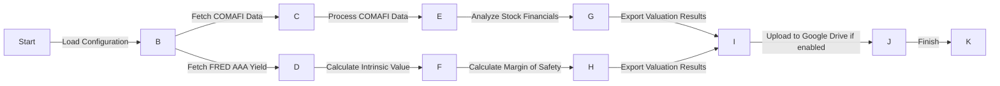

# CEDEAR Valuation Pipeline
The CEDEAR Valuation Pipeline is a Python-based system designed to fetch and process financial data for CEDEAR (Certificado de Depósito Argentino) valuation. It utilizes various data sources, including COMAFI, FRED, and stock market financials, to calculate intrinsic values and margins of safety for specified tickers and sectors.

## Key Features
* Fetches COMAFI CEDEAR data and processes ratios
* Retrieves FRED AAA yield for intrinsic value calculation
* Analyzes stock financials for specified tickers and sectors
* Calculates Graham intrinsic value and margin of safety
* Exports valuation results to Excel reports
* Optionally uploads reports to Google Drive using rclone

## Directory Hierarchy
```bash
├── .gitignore
├── README.md
├── pyproject.toml
├── src
│   ├── cedear_valuation
│   │   ├── __init__.py
│   │   ├── config.py
│   │   ├── exporters
│   │   │   ├── __init__.py
│   │   │   └── excel.py
│   │   ├── main.py
│   │   ├── models
│   │   │   ├── __init__.py
│   │   │   └── valuation.py
│   │   ├── scrapers
│   │   │   ├── __init__.py
│   │   │   ├── comafi.py
│   │   │   ├── fred.py
│   │   │   └── market.py
│   └── template_config.json
└── uv.lock
```

## Module Functionality
The CEDEAR Valuation Pipeline consists of several modules:
* `config.py`: Handles configuration loading from JSON files.
* `exporters/excel.py`: Exports valuation results to Excel reports.
* `models/valuation.py`: Calculates Graham intrinsic value and margin of safety.
* `scrapers/comafi.py`, `scrapers/fred.py`, `scrapers/market.py`: Fetch data from COMAFI, FRED, and stock market financials, respectively.
* `main.py`: Orchestrates the pipeline execution, from data fetching to report export and upload.

## Prerequisites and Environment Setup
To run the CEDEAR Valuation Pipeline, ensure you have:
* Python 3.8 or later installed
* A compatible operating system (Windows, macOS, or Linux)
* The `uv` package manager installed (for environment management)

Create and activate a virtual environment using `uv`:
```bash
uv sync
uv run python -m venv venv
source venv/bin/activate  # On Linux/macOS
venv\Scripts\activate  # On Windows
```
### Configuration
The pipeline uses a JSON configuration file (`config.json` by default). You can specify the following parameters:
* `fred_api_key`: Your FRED API key
* `google_drive`: Google Drive configuration (optional)
	+ `enabled`: Whether to upload reports to Google Drive (default: `false`)
	+ `remote_name`: The remote name for rclone (default: `gdrive`)
	+ `folder_name`: The folder name for uploaded reports (default: `CEDEAR_Reports`)
* `sectors`: A dictionary of sectors with tickers (e.g., `{"General": ["AAPL", "GOOG"]}`)

## Installation
To install the required dependencies, run:
```bash
uv sync
```
This will synchronize the environment using the `uv.lock` file.

## Usage Example
To execute the pipeline, run:
```bash
uv run python src/cedear_valuation/main.py
```
You can optionally specify a custom configuration file using the `--config` argument:
```bash
uv run python src/cedear_valuation/main.py --config path/to/config.json
```

## Usage Restrictions
The pipeline requires a stable internet connection for data fetching. Additionally, the FRED API key and Google Drive configuration (if used) must be valid and properly set up.

## Workflow Diagram

Note: This diagram illustrates the main workflow of the pipeline, from loading configuration to uploading reports to Google Drive (if enabled).