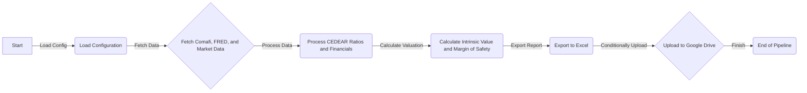

# CEDEAR Valuation Pipeline
The CEDEAR Valuation Pipeline is a Python-based system designed to fetch, process, and analyze financial data related to CEDEARs (Certificado de Depósito Argentino), providing valuation insights and uploading reports to Google Drive. This project leverages various libraries, including pandas for data manipulation, and utilizes the `rclone` command-line tool for cloud storage synchronization.

## Key Features
* Fetches financial data from multiple sources, including Comafi and FRED
* Calculates intrinsic value using the Graham formula and margin of safety
* Exports valuation reports to Excel files
* Optionally uploads reports to Google Drive using `rclone`
* Configurable via a JSON file for customization of sectors, tickers, and Google Drive settings

## Directory Hierarchy
```markdown
- .gitignore
- README.md
- pyproject.toml
- src
  - cedear_valuation
    - __init__.py
    - config.py
    - exporters
      - __init__.py
      - excel.py
    - main.py
    - models
      - __init__.py
      - valuation.py
    - scrapers
      - __init__.py
      - comafi.py
      - fred.py
      - market.py
- template_config.json
- uv.lock
```

## Module Functionality
The project is structured into several modules, each responsible for a specific aspect of the valuation pipeline:
- `config.py`: Handles loading of configuration from a JSON file.
- `exporters/excel.py`: Exports data to Excel files.
- `models/valuation.py`: Calculates intrinsic value and margin of safety.
- `scrapers`: Contains modules for fetching data from Comafi, FRED, and market sources.
- `main.py`: Orchestrates the entire pipeline, from data fetching to report generation and upload.

## Prerequisites and Environment Setup
To run the CEDEAR Valuation Pipeline, ensure you have:
- Python 3.8 or higher installed
- `poetry` or `pip` for package management
- `rclone` installed and configured for Google Drive access (if uploading reports)

Given the presence of `pyproject.toml`, this project uses Poetry for dependency management. To set up your environment:
1. Install Poetry if you haven't already.
2. Create and activate a virtual environment using Poetry by running `poetry install` in your project directory.

### Configuration
The pipeline is configurable via a JSON file (default: `config.json`). The configuration file should contain the following parameters:
- `fred_api_key`: Your FRED API key.
- `google_drive`: A dictionary with `enabled`, `remote_name`, and `folder_name` keys for Google Drive upload settings.
- `sectors`: A dictionary mapping sector names to lists of tickers.

Example configuration file:
```json
{
  "fred_api_key": "YOUR_FRED_API_KEY",
  "google_drive": {
    "enabled": true,
    "remote_name": "gdrive",
    "folder_name": "CEDEAR_Reports"
  },
  "sectors": {
    "General": ["TICKER1", "TICKER2"]
  }
}
```

## Installation
To install dependencies, run:
```bash
poetry install
```

## Usage Example
To execute the pipeline, use the following command:
```bash
poetry run python src/cedear_valuation/main.py
```
You can customize the configuration file path by using the `--config` argument:
```bash
poetry run python src/cedear_valuation/main.py --config path/to/your/config.json
```

## Usage Restrictions
- Ensure you have the necessary dependencies installed, including `rclone` for Google Drive uploads.
- The pipeline assumes you have a valid FRED API key and properly configured Google Drive settings if uploading reports.
- The system is designed to work with specific data sources and may require adjustments for other sources.

## Workflow Diagram

This diagram illustrates the main steps of the CEDEAR Valuation Pipeline, from loading configuration to conditionally uploading reports to Google Drive.