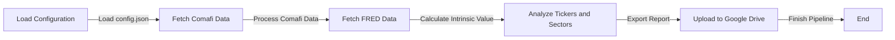

# CEDEAR Valuation Pipeline
The CEDEAR Valuation Pipeline is a Python-based system designed to fetch, process, and analyze financial data related to CEDEARs (Certificado de Depósito Argentino), providing valuation insights and uploading reports to Google Drive.

## Key Features
* Fetches data from various sources, including Comafi and FRED
* Processes and analyzes financial data for CEDEARs
* Calculates intrinsic value using the Graham formula and margin of safety
* Exports reports to Excel files
* Uploads reports to Google Drive

## Directory Hierarchy
```bash
├── .gitignore
├── README.md
├── pyproject.toml
├── src
│   └── cedear_valuation
│       ├── __init__.py
│       ├── config.py
│       ├── exporters
│       │   ├── __init__.py
│       │   ├── __pycache__
│       │   │   ├── __init__.cpython-314.pyc
│       │   │   └── excel.cpython-314.pyc
│       │   └── excel.py
│       ├── main.py
│       ├── models
│       │   ├── __init__.py
│       │   ├── __pycache__
│       │   │   ├── __init__.cpython-314.pyc
│       │   │   └── valuation.cpython-314.pyc
│       │   └── valuation.py
│       ├── scrapers
│       │   ├── __init__.py
│       │   ├── __pycache__
│       │   │   ├── __init__.cpython-314.pyc
│       │   │   ├── comafi.cpython-314.pyc
│       │   │   ├── fred.cpython-314.pyc
│       │   │   └── market.cpython-314.pyc
│       │   ├── comafi.py
│       │   ├── fred.py
│       │   └── market.py
├── template_config.json
└── uv.lock
```

## Module Functionality
The CEDEAR Valuation Pipeline is structured into several modules:
* `config.py`: Handles configuration loading from a JSON file.
* `exporters`: Contains modules for exporting data to different formats, currently only Excel.
* `main.py`: The entry point of the pipeline, responsible for orchestrating the entire process.
* `models`: Defines financial models, such as the Graham intrinsic value calculation.
* `scrapers`: Fetches data from various sources, including Comafi and FRED.

## Prerequisites and Environment Setup
To run the CEDEAR Valuation Pipeline, you will need:
* Python 3.8 or higher
* A compatible operating system (Windows, macOS, or Linux)
* The `poetry` package manager

To set up the environment:
1. Install `poetry` by following the instructions on the [official poetry website](https://python-poetry.org/docs/#installation).
2. Create a new virtual environment using `poetry` by running `poetry install` in the project directory.
3. Activate the virtual environment using `poetry shell`.

### Configuration
The pipeline uses a JSON configuration file (`config.json`) to store settings. The file should contain the following structure:
```json
{
    "fred_api_key": "YOUR_FRED_API_KEY",
    "google_drive": {
        "enabled": true,
        "remote_name": "gdrive",
        "folder_name": "CEDEAR_Reports"
    },
    "sectors": {
        "General": ["TICKER1", "TICKER2"]
    }
}
```
Replace the placeholder values with your actual FRED API key, Google Drive settings, and sector tickers.

## Installation
To install the required dependencies, run:
```bash
poetry install
```

## Usage Example
To run the pipeline, execute:
```bash
poetry run python src/cedear_valuation/main.py
```
You can also specify a custom configuration file using the `--config` argument:
```bash
poetry run python src/cedear_valuation/main.py --config path/to/config.json
```

## Usage Restrictions
The pipeline assumes that the `rclone` command is installed and configured on the system. If `rclone` is not installed, the pipeline will fail to upload reports to Google Drive.

## Workflow Diagram

Note: This diagram illustrates the high-level workflow of the pipeline. The actual implementation may vary depending on the specific requirements and configuration.