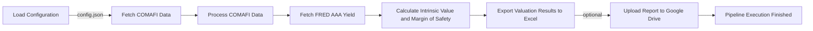

# CEDEAR Valuation Pipeline
The CEDEAR Valuation Pipeline is a Python-based system designed to fetch and process financial data for CEDEAR (Certificado de Depósito Argentino) valuation. It utilizes various data sources, including COMAFI, FRED, and market financials, to calculate intrinsic values and margins of safety for specified tickers and sectors.

## Key Features
* Fetches CEDEAR data from COMAFI
* Retrieves AAA yield from FRED
* Calculates Graham intrinsic value and margin of safety for specified tickers and sectors
* Exports valuation results to Excel
* Optionally uploads reports to Google Drive using `rclone`

## Directory Hierarchy
```bash
.
├── .gitignore
├── README.md
├── pyproject.toml
├── src
│   ├── cedear_valuation
│   │   ├── __init__.py
│   │   ├── config.py
│   │   ├── exporters
│   │   │   ├── __init__.py
│   │   │   └── excel.py
│   │   ├── main.py
│   │   ├── models
│   │   │   ├── __init__.py
│   │   │   └── valuation.py
│   │   └── scrapers
│   │       ├── __init__.py
│   │       ├── comafi.py
│   │       ├── fred.py
│   │       └── market.py
├── template_config.json
└── uv.lock
```

## Module Functionality
The CEDEAR Valuation Pipeline consists of several modules:
* `config.py`: Handles configuration loading from a JSON file
* `exporters/excel.py`: Exports valuation results to Excel
* `models/valuation.py`: Calculates Graham intrinsic value and margin of safety
* `scrapers/comafi.py`, `scrapers/fred.py`, `scrapers/market.py`: Fetch data from COMAFI, FRED, and market financials, respectively
* `main.py`: Orchestrates the pipeline execution

## Prerequisites and Environment Setup
To run the CEDEAR Valuation Pipeline, you'll need:
* Python 3.8+
* `rclone` (for Google Drive uploads)
* A compatible operating system (Linux, WSL, or similar)

### Virtual Environment Setup
The project uses `pyproject.toml` for dependency management. To create and activate a virtual environment:
```bash
poetry install
poetry shell
```

### Configuration
The pipeline uses a JSON configuration file (`config.json`) to store settings. The file should contain the following parameters:
* `fred_api_key`: FRED API key
* `google_drive` (optional): Google Drive configuration
	+ `enabled`: Whether to upload reports to Google Drive
	+ `remote_name`: `rclone` remote name
	+ `folder_name`: Target folder path on Google Drive

Example `config.json`:
```json
{
  "fred_api_key": "YOUR_FRED_API_KEY",
  "google_drive": {
    "enabled": true,
    "remote_name": "inverg",
    "folder_name": "CEDEAR_Reports"
  }
}
```

## Installation
To install the required dependencies:
```bash
poetry install
```

## Usage Example
To run the pipeline:
```bash
poetry run python src/cedear_valuation/main.py --config config.json
```

## Usage Restrictions
The pipeline assumes that the `rclone` configuration is set up correctly and that the Google Drive remote is accessible. Additionally, the pipeline requires a valid FRED API key to fetch AAA yield data.

## Workflow Diagram
