# CEDEAR Valuation Pipeline
The CEDEAR Valuation Pipeline is a Python-based application designed to fetch and process financial data for CEDEARs (Certificado de Depósito Argentino), calculate their intrinsic value using the Graham formula, and export the results to an Excel report. The pipeline utilizes various data sources, including Comafi, FRED, and market financials, to provide a comprehensive valuation analysis.

## Key Features
* Fetches CEDEAR data from Comafi and processes the ratios
* Retrieves the FRED AAA yield for intrinsic value calculation
* Analyzes stock financials for tickers and sectors specified in the configuration
* Calculates the Graham intrinsic value and margin of safety for each stock
* Exports the valuation results to an Excel report
* Optionally uploads the report to Google Drive using rclone

## Directory Hierarchy
```bash
.
├── .gitignore
├── README.md
├── pyproject.toml
├── src
│   └── cedear_valuation
│       ├── __init__.py
│       ├── config.py
│       ├── exporters
│       │   ├── __init__.py
│       │   ├── __pycache__
│       │   │   ├── __init__.cpython-314.pyc
│       │   │   └── excel.cpython-314.pyc
│       │   └── excel.py
│       ├── main.py
│       ├── models
│       │   ├── __init__.py
│       │   ├── __pycache__
│       │   │   ├── __init__.cpython-314.pyc
│       │   │   └── valuation.cpython-314.pyc
│       │   └── valuation.py
│       └── scrapers
│           ├── __init__.py
│           ├── __pycache__
│           │   ├── __init__.cpython-314.pyc
│           │   ├── comafi.cpython-314.pyc
│           │   ├── fred.cpython-314.pyc
│           │   └── market.cpython-314.pyc
│           ├── comafi.py
│           ├── fred.py
│           └── market.py
├── template_config.json
└── uv.lock
```

## Module Functionality
The CEDEAR Valuation Pipeline consists of several modules, each responsible for a specific task:
* `config.py`: Loads the configuration from a JSON file
* `exporters/excel.py`: Exports the valuation results to an Excel report
* `models/valuation.py`: Calculates the Graham intrinsic value and margin of safety
* `scrapers/comafi.py`: Fetches CEDEAR data from Comafi
* `scrapers/fred.py`: Retrieves the FRED AAA yield
* `scrapers/market.py`: Fetches stock financials for tickers and sectors
* `main.py`: Orchestrates the pipeline execution, from data fetching to report export and upload

## Prerequisites and Environment Setup
To run the CEDEAR Valuation Pipeline, you will need:
* Python 3.8 or later
* A compatible operating system (Windows, macOS, or Linux)
* The `poetry` package manager (install using `pip install poetry`)

To set up the environment:
1. Install the required dependencies using `poetry install`
2. Create a virtual environment using `poetry shell`
3. Activate the virtual environment

### Configuration
The pipeline uses a JSON configuration file (`config.json`) to store settings such as the FRED API key, Google Drive configuration, and tickers/sectors to analyze. The configuration file should have the following structure:
```json
{
    "fred_api_key": "YOUR_FRED_API_KEY",
    "google_drive": {
        "enabled": true,
        "remote_name": "gdrive",
        "folder_name": "CEDEAR_Reports"
    },
    "sectors": {
        "General": ["TICKER1", "TICKER2"]
    }
}
```
Replace the placeholder values with your actual FRED API key, Google Drive configuration, and tickers/sectors.

## Installation
To install the CEDEAR Valuation Pipeline, run the following command:
```bash
poetry install
```
This will install the required dependencies and create a virtual environment.

## Usage Example
To run the pipeline, execute the following command:
```bash
poetry run python src/cedear_valuation/main.py
```
This will start the pipeline, fetch the required data, calculate the intrinsic values, and export the results to an Excel report. If Google Drive upload is enabled in the configuration, the report will be uploaded to the specified folder.

## Usage Restrictions
The pipeline requires a valid FRED API key and a compatible Google Drive configuration to function correctly. Additionally, the pipeline assumes that the required dependencies are installed and the virtual environment is activated.

## Workflow Diagram

```mermaid
graph LR
    A[Start] -->|Load Config| B(Load Configuration)
    B -->|Fetch Comafi Data| C(Fetch Comafi Data)
    C -->|Process Comafi Data| D(Process Comafi Data)
    D -->|Fetch FRED AAA Yield| E(Fetch FRED AAA Yield)
    E -->|Analyze Tickers/Sectors| F(Analyze Tickers/Sectors)
    F -->|Calculate Intrinsic Value| G(Calculate Intrinsic Value)
    G -->|Export to Excel| H(Export to Excel)
    H -->|Upload to Google Drive| I(Upload to Google Drive)
    I -->|Finish| J(Finish)
```

This diagram illustrates the pipeline's workflow, from loading the configuration to uploading the report to Google Drive.